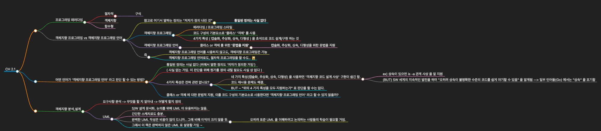
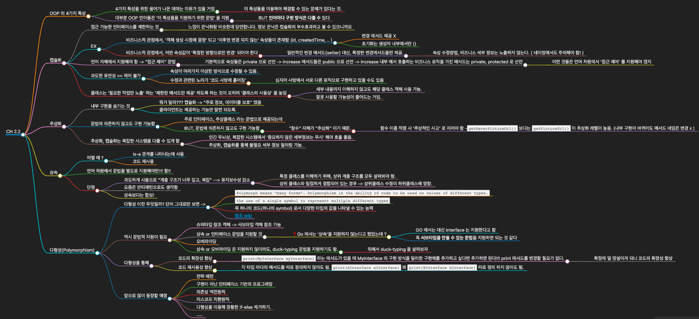

- 프로그래밍 패러다임
    - 절차적
        - 구식
    - 객체지향
    - 함수형
- 객체지향 프로그래밍 vs 객체지향 프로그래밍 언어
    - 참고로 여기서 말하는 정의는 "저자가 정의 내린 것"
        - **통일된 정의는 사실 없다**
    - 객체지향 프로그래밍
        - 패러다임 / 프로그래밍 스타일
        - 코드 구성의 기본요소로 '클래스' '객체' 를 사용
        - 4가지 특성 ( 캡슐화, 추상화, 상속, 다형성 ) 을 초석으로 코드 설계/구현 하는 것
    - 객체지향 프로그래밍 언어
        - 클래스 or 객체 를 위한 **'문법을 지원'**
            - 캡슐화, 추상화, 상속, 다형성을 위한 문법을 지원
    - 즉
        - 객체지향 프로그래밍 언어를 사용하지 않고도, 객체지향 프로그래밍은 가능
        - 객체지향 프로그래밍 언어로도, 절차적 프로그래밍을 할 수도.. 🙀
- 어떤 언어가 '객체지향 프로그래밍 언어' 라고 판단 할 수 있는 방법?
    - 통일된 정의는 사실 없다 (위에서 말한 정의도 '저자가 정의한 거임')
    - ( 사실 없는 거임. 이 판단을 위해 뭔가를 정의 내릴 필요도 사실 상 없다 )
    - 4가지 특성은 전혀 관련 없나요?
        - 네 가지 특성(캡슐화, 추상화, 상속, 다형성) 을 사용하면 '객체지향 코드 설계 사상' 구현이 쉽긴 함.
            - ex) 상속이 있으면 is -a 관계 사상 을 잘 지원
            - (BUT) SW 세계의 지속적인 발전을 하며 "오히려 상속이 불명확한 수준의 코드를 쉽게 야기할 수 있음" 을 알게됨 --> 일부 언어들(Go) 에서는 "상속" 을 포기함
        - 코드 재사용 문제도 해결.
        - BUT ~ "위의 4 가지 특성을 모두 지원하는가" 로 판단을 할 수는 없다.
    - 클래스 or 객체 에 대한 문법적 지원, 이를 코드 구성의 기본요소로 사용한다면 '객체지향 프로그래밍 언어' 라고 할 수 있지 않을까?
- 객체지향 분석,설계
    - 요구사항 분석 -> 무엇을 할 지 알아내 -> 어떻게 할지 정의
    - UML
        - S/W 설계 문서화, 논의를 위해 UML 이 유용하지는 않음.
        - 간단한 스케치로도 충분.
        - 완벽한 UML 작성은 비용이 많이 드니까.. 그에 비해 이익이 크지 않을 듯.
            - 오히려 표준 UML 을 이해하려고 논의하는 사람들의 학습이 필요할 거임.
        - 그래서 이 책은 완벽하지 않은 UML 로 설명할 거임 ~

----------------


## OOP 의 4가지 특성

- 4가지 특성을 위한 용어가 나온 데에는 이유가 있을 거임
    - 이 특성들을 이용해야 해결할 수 있는 문제가 있다는 것.
- 대부분 OOP 언어들은 '이 특성들을 지원하기 위한 문법' 을 지원
    - BUT **언어마다 구현 방식은 다를 수** 있다

## 캡슐화

```java
@Getter
public class Wallet {

    private String id;

    private long createdTime;

    private BigDecimal balance;

    private long balanceLastModifiedTime;

    public Wallet() {
        this.id = IdGenerator.getInstance().generate();
        this.createdTime = System.currentTimeMillis();
        this.balance = BigDecimal.ZERO;
        this.balanceLastModifiedTime = System.currentTimeMillis();
    }

    public void increaseBalance(BigDecimal increasedAmount) {
        if (increasedAmount.compareTo(BigDecimal.ZERO) < 0) {
            throw new RuntimeException("");
        }
        this.balance.add(increasedAmount);
        this.balanceLastModifiedTime = System.currentTimeMillis();
    }

    public void decreaseBalance(BigDecimal decreasedAmount) {
        if (decreasedAmount.compareTo(BigDecimal.ZERO) < 0) {
            throw new RuntimeException("");
        }
        if (decreasedAmount.compareTo(this.balance) > 0) {
            throw new RuntimeException("");
        }
        this.balance.subtract(decreasedAmount);
        this.balanceLastModifiedTime = System.currentTimeMillis();
    }
```

- 접근 가능한 인터페이스를 제한하는 것
    - 느낌이 은닉화랑 비슷한데 당연합니다. 정보 은닉은 캡슐화의 부수효과라고 볼 수 있으니까요
- EX
    - 비즈니스적 관점에서, '객체 생성 시점에 결정' 되고 '이후엔 변경 되지 않는' 속성들이 존재함 (id, createdTime, .. )
        - 변경 메서드 제공 X
        - 초기화는 생성자 내부에서만 ()
    - 비즈니스적 관점에서, 어떤 속성값이 '특정한 방향으로만 변경' 되어야 한다
        - 일반적인 변경 메서드(setter) 대신, 특정한 변경메서드들만 제공.
            - 속성 수정방법, 비즈니스 세부 정보는 노출하지 않는다. ( 네이밍에서도 주의해야 함! )
- 언어 자체에서 지원해야 함 -> "접근 제어" 문법
    - 기본적으로 속성들은 private 으로 선언 -> increase 메서드들은 public 으로 선언 -> Increase 내부 에서 호출하는 비즈니스 로직을 가진 메서드는 private, protected 로 선언
        - 이런 것들은 언어 차원에서 '접근 제어' 를 지원해야 겠지
- 과도한 유연성 == 제어 불가
    - 속성이 여러가지 이상한 방식으로 수정될 수 있음.
    - 수정과 관련된 노리가 '코드 사방에 흩어짐'
        - 심지어 사방에서 서로 다른 로직으로 구현하고 있을 수도 있음
- 클래스는 '필요한 작업만 노출' 하는 '제한된 메서드만 제공' 하도록 하는 것이 오히려 '클래스의 사용성' 을 높임
    - 세부 내용까지 이해하지 않고도 해당 클래스 객체 사용 가능.
    - 잘못 사용할 가능성이 줄어드는 거임.

## 추상화

- 내부 구현을 숨기는 것
    - 뭐가 달라??? 캡슐화 -> "주로 정보, 데이터를 보호" 였음
    - 클라이언트는 제공하는 기능만 알면 되도록.
- 문법에 의존하지 않고도 구현 가능함
    - 주로 인터페이스, 추상클래스 라는 문법으로 제공되는데
    - BUT, 문법에 의존하지 않고도 구현 가능함
        - "함수" 자체가 "추상화" 이기 때문.
            - 함수 이름 작명 시 '추상적인 사고' 로 지어야 함 -`getNaverPictureUrl()` 보다는 `getPictureUrl()` 이 추상화 레벨이 높음. (내부 구현이 바뀌어도 메서드 네임은 변경 x )
- 추상화, 캡슐화는 복잡한 시스템을 다룰 수 있게 함
    - 인간 두뇌상, 복잡한 시스템에서 '중요하지 않은 세부정보는 무시' 해야 효율 좋음.
    - 추상화, 캡슐화를 통해 불필요 세부 정보 필터링 가능.

## 상속

- 어떨 때 ?
    - is-a 관계를 나타내는데 사용
    - 코드 재사용
- 언어 차원에서 문법을 별도로 지원해야만!!! 함!!
- 단점
    - 과도하게 사용으로 "계층 구조가 너무 깊고, 복잡" --> 유지보수성 감소
        - 특정 클래스를 이해하기 위해, 상위 계층 구조를 모두 살펴봐야 함.
        - 상위 클래스와 밀접하게 결합되어 있는 경우 -> 상위클래스 수정이 하위클래스에 영향.
    - 요즘은 안티패턴으로도 생각함
    - 상속보다는 합성!

## 다형성(Polymorphism)

- 다형성 이란 무엇일까? 단어 그대로만 보면 ->
    - `Polymorph means “many forms”. Polymorphism is the ability of code to be used on values of different types.`
    - `the use of a single symbol to represent multiple different types`
    - 즉 하나의 코드(하나의 symbol) 로서 다양한 타입의 값을 나타낼 수 있는 능력
    - [참조 wiki](https://en.wikipedia.org/wiki/Polymorphism_(computer_science))
- 역시 문법적 지원이 필요
    - 슈퍼타입 참조 객체 -> 서브타입 객체 참조 가능
    - 상속 or 인터페이스 문법을 지원할 것
        - ❓ Go 에서는 '상속'을 지원하지 않는다고 했었는데 ?
            - GO 에서는 대신 interface 는 지원한다고 함
            - 즉 **서브타입을 만들 수 있는 문법**을 지원하면 되는 것 같다
    - 오버라이딩
    - 상속 or 오버라이딩 은 지원하지 않더라도, duck-typing 문법을 지원하기도 함.
        - 오리처럼 생기지 않은 기계를 '오리로 판단' 하기 위해 '오리처럼 걷고, 운다면 그것은 오리다' 라는 기준을 세웠던 duck- test 처럼 , 문법으로 해당 형식을 명확하게 지정하는 대신 해당 형식을 사용할 수 있으면 모두 자동으로 대응하는 방식.
        - python, javascript
        - 뒤에 예시를 살펴보며 duck-typing 지원 언어와 Java 의 차이를 간단하게 보자
- 다형성을 통해
    - 코드의 확장성 향상
        - `print(MyInterface myInterface)` 라는 메서드가 있을 때 MyInterface 의 구현 방식을 달리한 구현체를 추가하고 싶다면 추가하면 된다!!! print 메서드를 변경할 필요가 없다.
            - 확장에 덜 망설이게 되니 코드의 확장성 향상
    - 코드 재사용성 향상
        - 각 타입 마다의 메서드를 따로 정의하지 않아도 됨. `print(AInterface aInterface)` 와 `print(BInterface bInterface)` 따로 정의 하지 않아도 됨.
- 앞으로 많이 등장할 예정
    - 전략 패턴
    - 구현이 아닌 인터페이스 기반의 프로그래밍
    - 의존성 역전원칙
    - 리스코프 치환원칙
    - 다형성을 이용해 장황한 if-else 제거하기.
    - .....

---

## duck typing

오리처럼 생기지 않은 기계를 '오리로 판단' 하기 위해 '오리처럼 걷고, 운다면 그것은 오리다' 라는 기준을 세웠던 duck- test 처럼 ,  문법으로 해당 형식을 명확하게 지정하는 대신 해당 형식을 사용할 수 있으면 모두 자동으로 대응하는 방식.

- python, javascript

```python
class Logger:
	def record(self):
		print("I write a log. into file.")
class DB:
	def record(self):
		print("I insert data into db")
def test(recorder):
	recorder.record()

def demo():
	logger = Logger()
	db = DB()
	test(logger)
	test(db)
```

- Logger 클래스와 DB 클래스는 아무런 관련이 없음.
    - 어떤 계층관계도 갖고 있지 않음
- 그럼에도 두 클래스 모두 record() 메서드를 정의만 했다면,
    - test 메서드에 객체를 전달할 수 있으며, 이 test 메서드에서는 적절한 record() 메서드를 찾아 실행 할 수 있다.
- ***일부 동적 언어***에서만 사용되는 문법
    - ***Java 같은 정적 언어***에서는, ***다형성 구현을 위해 클래스 간의 관계를 정의***해야하는 것과 대조됨.

## 생각

### JAVA 는 왜 다중상속을 지원하지 않을까?
