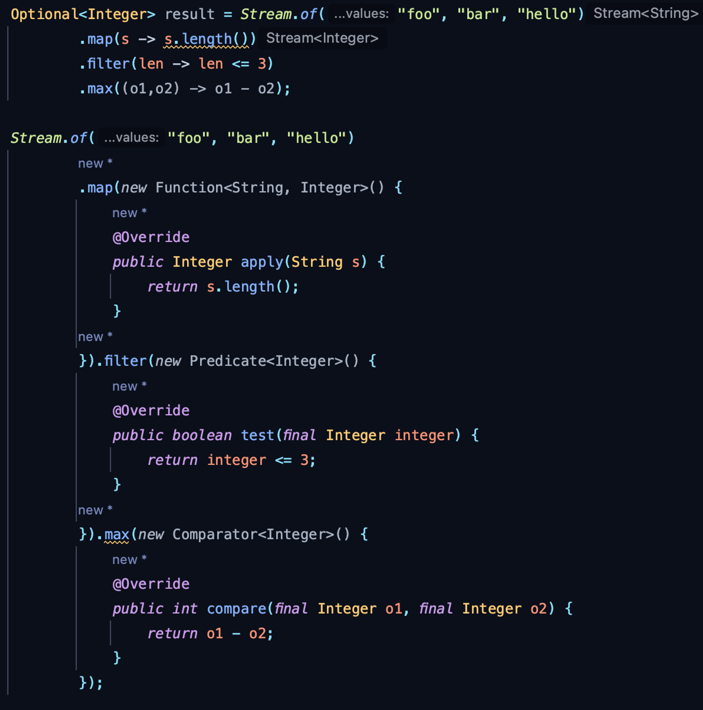

# 객체지향, 절차적, 함수형 프로그래밍

- 절차적 프로그래밍
    - “데이터” 가 “메서드”와 분리되어 있음
        - 실행되는 **메서드들을 “순서대로 나열” 하여 “데이터를 조작”**
    - 보통 절차적 프로그래밍 **언어들**은, 클래스를 지원 X , 상속,다형성,캡슐화 같은 객체지향 특성도 지원 X
    - **절차적 코드를 보면 보통, “메서드와 데이터 구조” 의 정의가 “서로 관계가 없다”**
- **객체지향 프로그래밍 스타일** : 관련된 메서드와 데이터 구조가 하나의 클래스에 정의되어 있다
    - → **메서드와 데이터구조가 매우 밀접한 관계**를 갖는다.
        - 그래서 리팩토링 팁에 대한 글들에서 이런 말 자주 봄 :  클래스 내 특정 메서드들에서만 사용되고 있는 데이터들이 있으면 “관련 데이터와 메서드” 들을 별도의 클래스로 분리 하라.

## 객체지향 프로그래밍 패러다임이 대세가 된 이유가 뭘까?

### 대규모의 복잡한 프로그램 개발에 더 적합

- 필요한 블럭들 만을 조합해서 뭔가 만드는 것 처럼 할 수 있음
    - 작업 처리 흐름에 따라 객체를 조합해 프로그램을 구성함.
    - 이런 방식이 우리가 생각하는 방식을 더 명확하게 만들 수 있다.
- 모듈식 방법을 제공한다.
    - 굉장히 많은 데이터와, 기능들이 필요 한 경우 이들을 분류한다면 깔끔해 보일 것임. 클래스는 이렇게 기능과 데이터 구조를 분류하는 좋은 방법이며 코드를 모듈화 하는 수단임.
        - 물론 C 언어 같은 절차적 언어에서 “파일 쪼개기” 로 “함수와 데이터 구조 분류” 라는 목적을 달성할 수도 있긴 함. 하지만 이런 모듈화가 강제 하는 편이 아님.. 반면 객체지향 언어에서는 클래스 를 기반으로 동작하는 게 많다보니 클래스 모듈화가 필수 라고 생각될 수 있음.

### 코드 재사용, 확장, 유지 관리가 쉬움

- 보통 객체지향 의 네 가지 특성이 이를 가능하게 함
    - 물론 그렇게 코드를 짜야지만

### 더 사용자 친화적 / 고급언어

초기 프로그래밍 언어는 바이너리 명령어와 어셈블리 언어였음. 여기서 점차 절차적 언어로 진화함.

이들 모두 일련의 명령을 순서대로 호출하면서 데이터를 순차적으로 조작하는 스타일을 갖고 있었음.

하지만 프로그래밍 언어는 사람이 기계와 상호작용 하는 방법이다. 따라서 이는 점차 사람이 사용하기 쉬운 방식으로 진화되어 오고 있음. 이를 점점 더 고급언어로 발전하고 있다고 말하곤 함.

그렇다 보니 인간의 사고방식을 사용하는 방식으로 진화하고 있음.

절차적 언어에서 점점 발전하며 등장한 객체지향 언어들은 더 사용자 친화적인 고급언어라고 볼 수 있음. ( 물론 인간의 사고는 절차적에 가깝지만..ㅎ. 유지보수하기엔 추상화 시킨 레벨 단위로 보는게 더 좋긴함)

## 함수형 프로그래밍

- 여기서 함수 : 수학에서의 함수.
    - **특히 Stateless 한 함수 (NOT statefull)**
        - 객체지향 프로그래밍 에서는, **클래스의 멤버 변수를 사용**하는 함수가 많음.
        - 절차적 언어에서는, **전역 변수**를 공유하며 사용하는 함수가 많음.
        - Stateless 함수는 **지역변수만을** 사용함.
            - 실행 결과는 오로지 입력 매개변수에만 관련됨 → 같은 입력 매개변수라면 매 번 같은 결과를 내야 함.

            ```java
            int sum = 0;
            int sum(int operand) {
            	sum += operand; 
            	return sum;
            }
            ```

            ```java
            int sum(int accum, int operand) {
            	return accum + operand
            }
            ```

- **데이터 처리, 통계분석과 같은 특정 시나리오에 적절**함.
- 비즈니스와 밀접한 관련이 있는 대규모 비즈니스 시스템의 개발 시나리오에서는, 더 읽기 쉽고 유지보수가 용이한 객체지향 프로그래밍이 더 적합.
- 함수형 프로그래밍을 위해 **반드시 함수형 언어가 필요한가 ?**
    - 이를테면 객체지향 언어인 Java 에서도 함수형 프로그래밍을 할 수 있도록 문법, 라이브러리를 지원하는 흐름이 나타남
- Java 에서 지원되고 있는 함수형 프로그래밍 요소들( 표준 라이브러리에 추가된 )
    - ✔️ Stream 클래스
        - (이게 다는 아니지만-ex)lazy evaluation) 순서대로 호출하는 메서드를 가독성 있게 표현할 수 있어짐
    - ✔️ lambda expression
        - 하나의 기능 구현체만 을 제공하기 위해 “익명 클래스 구현”, “특정 클래스 구현” 을 정의 하지 않아도 되게 되었음.
            - 코드 작성을 단순화 하게 됨.
        - Java 에서는 내부적으로 Functional interface 를 기반으로 람다 표현식 을 지원하고 있음
            - lambda expression 구성 : input, body, output

              

    - ✔️ 함수형 인터페이스
        - C 언어는 포인터를 사용해 함수를 변수 처럼 사용 가능
        - Java 에서는 인터페이스를 통해 함수를 감싼 것을 변수로 사용
            - 미구현 메서드가 단 하나만 존재 해야 함.
                - 동일한 시그니쳐를 가진 미구현 메서드가 여러개인 인터페이스는, 컴파일 시점에 어떤 미구현 메서드에 대응 되는 람다표현식인지 알 수 없기 때문.

## 객체지향, 함수형 프로그래밍 비교

앞에서 말한 것 처럼

- 함수형은 **데이터 처리, 통계분석과 같은 특정 시나리오에 적절** / 객체지향 프로그래밍은  대규모 비즈니스 시스템의 개발 시나리오 에 적절함.
    - 따라서 **함수형 프로그래밍이 일반적인 객체지향 프로그래밍 패러다임을 완전히 대체할 수는 없음.**
- 객체지향 프로그래밍은 클래스 설계 등의 **모듈 설계에 초점(추상적인 계층을 먼저 그려나감)** / 절차형, 함수형은 특정 **구현세부 사항**에 초점을 둠.


### Q) 그런데 UNIX, LINUX 같은 대규모의 복잡한 프로그램은 왜 여전히 절차적 프로그래밍을 사용하는 걸까?

---

# 2.5 객체지향 프로그래밍 처럼 보이나 실제로는 절차적 프로그래밍인 경우들

언어 자체가 클래스를 지원해서 클래스로 작성했다고 다 객체지향 프로그래밍은 아님.

결국 스스로 주의해야 하는 것인데, 주의해야 할 부분들 몇 가지 예시를 들어주고 있음

## getter, setter 남용

- Lombok 같은 plugin 도구 사용시  아무 생각 없이 getter, setter 를 만들게 됨.
- setter 남용
    - 보통 setter 를 남용해, 내부 데이터 변경에 대해 **“제한된 인터페이스만 제공” 하는게 아니게 됨.**
    - 외부에서 어떤 데이터든 마음대로 수정 → ***절차적 스타일 코드가 작성됨***.
    - THEN HOW?
        - 데이터 변경에 대해서는 제한된 인터페이스만 제공할 것
        - ( 내 생각 ) 데이터 변경 메서드 를 제공 하더라도 , 내부적으로 불변식 을 유지할 수 있도록 구현한 인터페이스만 제공할 것

        ```java
        public class Stock {
        	...
        	public void decrease() {
        		if(this.count < 0 ) {
        				throw new OutOfStockException();
        		}
        		this.count--;
        	}
        ```

- **getter 남용 !( setter 뿐만 아니라 getter 도 주의)**
    - getter 메서드가, 최소한 내부 값을 손상키지 않는 경우라면 무해하다 고 볼 수 있음.
    - ⚠️  문제가 되는 경우 = 내부 값을 손상 시킬 수 있는 getter → **내부 Collection 을 “그대로 반환”** 하는 getter

        ```java
        public class ShoppingCart {
        	private int itemsCount;
        	private double totalPrice;
        	private List<ShoppingCartItem> items = new ArrayList<>();
        	...
        	public List<ShoppingCartItem> getItems() { return this.items;}
        ```

        - ⚠️  **외부에서 items 컬렉션을 직접 수정 하는 것이 가능 / 내부 데이터를 수정하는 것이 가능**
            - → items 에는 아이템이 추가되었는데, ShoppingCart 내부에 이 items 와 연관된 다른 속성들은 변경되지 않음 —> 속성 값들 끼리의 연계성이 깨짐.
        - THEN HOW?
            - ✅ getter 를 그대로 제공하지 말고 **컬렉션에 대한 조작 과 관련된 인터페이스를 ShoppingCart 에서 따로 제공해야함.**

                ```java
                public class ShoppingCart {
                	private int itemsCount;
                	private double totalPrice;
                	private List<ShoppingCartItem> items = new ArrayList<>();
                	...
                	public void clear() {
                	  this.items.clear();
                	}
                }
                ```

            - 장바구니 항목을 확인해야 하는 요구사항이 있다면 ???
                - ✅ **불변 컬렉션 객체를 새로 생성해서 리턴 하는 메서드 를 제공**

                ```java
                public List<ShoppingCartItem> getItems() {
                     return Collections.unmodifiableList(this.items);
                 }
                ```


            ⚠️ ***여전히 문제가 존재함 → Collection 내부 원소가 객체라면 , 외부에서 이 원소 객체 의 상태를 변경하는게 가능***함. ( 6.6 에서 보도록 하자 _ 내 생각에는 불변과 관련된 부분을 강조하지 않을까? getter 에서도 새로운 객체를 copy 해서 리턴하는 등의 일을 하게 될 것 같음 ) 


---

## 전역 메서드, 변수 남용

절차적 언어의 경우 거의 모든 곳에서 전역 변수,메서드를 볼 수 있음..


- Java 같은 객체지향 언어에서는?
    - 싱글턴 객체
        - 프로세스 에서 단 하나만 존재해서 전역 변수 처럼 볼 수 있을 지도?
    - static member 변수
        - 인스턴스화된 모든 객체들에서 공유
    - public static final 로 정의한 상수들
        - 전역 변수처럼 취급
    - 정적 메서드
        - 메서드가 클래스 내부 데이터에서 분리되어 있음
        - 캡슐화 가 제거된 절차적 프로그래밍 스타일로 코드를 구성하게 됨.

### 크고 포괄적인 Constants 상수 클래스 정의 문제

```java
public class Constants {
    // 예시: 원주율
    public static final double PI = 3.14159265358979323846;

    // 예시: 시간 관련 상수
    public static final int SECONDS_PER_MINUTE = 60;
    public static final int MINUTES_PER_HOUR = 60;
    public static final int HOURS_PER_DAY = 24;

    // 예시: 색깔 상수
    public static final String RED = "RED";
    public static final String GREEN = "GREEN";
    public static final String BLUE = "BLUE";
```

- 코드 유지 보수성
    - 해당 Constants 클래스를 사용하는 개발자가 많다면?… 엄청난 코드 충돌이 예상됨
        - 사이드 프로젝트에서 예외 메시지를 ERROR_MESSAGE 클래스에 메시지 하나씩 추가할 때의 기억
    - 컴파일 시간 증가
        - 상수가 많을 수록, 이 클래스에 종속된 클래스들이 증가
            - Constants 클래스 수정할 때마다 종속된 다르 클래스들이 매번 다시 컴파일 됨 → 불필요한 컴파일 시간 증가
            - 단위 테스트 실행 시에도 매 번 컴파일이 실행되는데.. 단위 테스트 실행 시간도 늘어남.
    - 코드 재사용성
        - Constants 에 있는 색깔 상수들만 사용하고 싶은데 Constants 클래스 전체를 , 우리 모듈에 포함시켜야 하게 됨.
- THEN HOW ?
    - 관련된 상수들끼리 상수 클래스를 분리하기
        - ex) Redis 관련 설정들을 가진 RedisConfig 클래스를 별도로 두는게, 클래스의 응집력과 코드 재사용성 향상 시킬 수 있음

### Utils 클래스 정의

두 클래스 가 공통으로 사용하는 기능이 있다… 각 클래스에 해당 메서드를 정의하면 코드 중복이 된다.

이럴 때 어떤 방법을 택할 것인가?

- 상위 클래스에 공통 메서드를 두고, 두 클래스는 이 상위 클래스의 하위 클래스가 되도록 하기
    - 그런데 A, B 클래스가 전혀 관련이 없는 클래스들이라면? ***서로 아무런 관계가 없음에도 단순히 코드 재사용 만을 위해 상위 클래스를 추상화하고 상속을 사용하게 되면 오히려 이해하기 어려운 코드***가 만들어진다.

따라서 이런 경우를 위해 Utils 클래스를 사용하게 된 것이다.

- Utils 클래스는 절차적 프로그래밍 스타일을 만들게 된다.
    - Utils 에 들어가는 기능들은
        - 서로 공유할 데이터가 없다 (간혹 상수, 의존하는 기능 구현체 정도는 공유할수도)
        - 정적 메서드들
    - 속성은 없으면서 정적 메서드만 포함하고 있는 Utils 클래스는 절차적 스타일에 해당하기 때문임

- 따라서 Utils 클래스를 만들어야겠다 싶다면, 먼저 고려해봐야 할게 있다.
    - 별도의 Utils 클래스를 정의해야만 하는가?! Utils 클래스에 들어갈 일부 메서드를 다른 클래스로 정의할 수 있지는 않은가???

  이를 고민한 후에도 Utils 클래스가 필요하다면 정의하자.

- Constants 처럼, 기능에 따라 다른 유틸성 클래스를 만들도록 하자!! 모든 기능을 하나의 큰 클래스에 넣지 말 것.

---

## 데이터와 메서드 분리로 클래스 정의하기

앞에서 분명, 관련된 기능과 데이터들을 하나의 클래스로 설계해야 한다고 했다.

그런데 MVC 구조를 기반으로 한 백엔드 개발에서 “데이터 전용 클래스(Entity)”를 두고 “기능은 다른 클래스에(Controller, Service, Repository) 정의하는 형태의 코드들” 이 작성되곤 한다.

사실 이건 **“빈약한 도메인 모델” 을 기반으로 했을 때** 생겨나는 일임.  ( 생각해보면 작년까지만 해도, 많은 비즈니스 로직들이 XXXService 의 메서드들에 그대로 다 나열되어 있었음 )

## 왜 사람들은 절차적 프로그래밍 스타일 코드를 작성할까?

사람의 사고 방식은 보통 “작업을 단계별로 수행하는 방법” 으로 동작한다. 이는 절차적 프로그래밍 스타일과 일치한다.

반면 객체지향 프로그래밍은 , “클래스를 먼저 설계” 하고 “클래스 사이 상호작용을 설계” 하고, 이들을 프로세스에 맞게 조합한다. 인간의 사고와는 완전히 일치하지 않아 상대적으로 어렵다.

특히 클래스 설계는 기술과 경험을 필요로 하다보니, 많은 엔지니어가 많은 생각이 필요하지 않은 방식으로 요구사항을 구현하는 절차적 프로그래밍 코드를 작성하게 되는 것이다.

절차적 프로그래밍이 시대에 떨어진 방식은 아니다. 간단하거나 데이터 처리와 관련된 것은 스크립트 스타일의 절차적 방식이 더 적합하다. 또한 어쨌거나 객체지향 속에서도 절차적인 코드들이 존재하니 근간이 된다 할 수 있음.

절차적 프로그래밍과 객체지향 프로그래밍은 양자택일의 대상이 아님!

궁극적 목표는 유지하기 쉽고, 가독성이 좋고, 재사용이 좋고, 확장성이 좋은 고품질 코드 작성이다!
