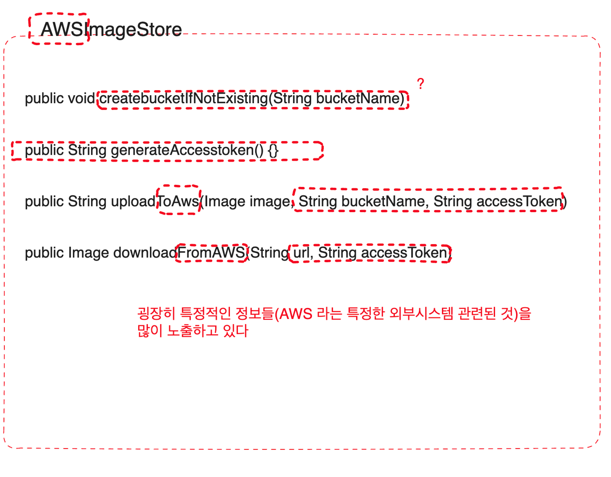
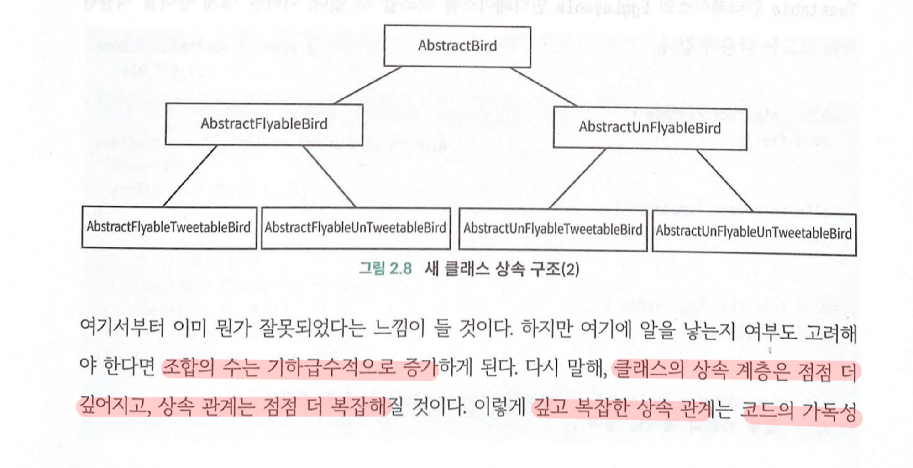

## 2.7.2 추상클래스와 인터페이스

### 추상 클래스, 인터페이스 하면 어떤 특징이 있는가 ?  어떤 프로그래밍 문제를 해결 할 수 있는가?

추상클래스는 코드재사용에 초점을, **인터페이스는 decoupoling 에 초점**을 맞춘다

### ✅ **추상 클래스는 “단순히 코드 재사용” 의 장점이 있는걸까 ? 이는 “상속” 에서 오는 특징인데.. 그러면 “일반 클래스”와 어떤 차이가 있는 것일까?**

이에 대해서는 “추상 클래스이던 것” 을 “일반 클래스로 변경” 했다고 생각하고 앞으로 어떤 일이 벌어질지 상상의 나래를 펼쳐보면서 그 차이를 알수가 있었다

- **하위 클래스로 구현의 책임을 돌릴 수 없다. 상위 클래스에는 비어있는 메서드라도 무조건 구현을 해 두어야** 한다
    - 비어있는 메서드의 이유에 대한 주석이 없다면, **상속관계를 전부 확인하며 설계의도를 파악하는 비용**이 든다
- **하위 클래스로 구현의 책임을 “강제화” 할 수 없다**. 새로 추가되는 **하위 클래스들에서는 제대로 구현을 하지 않을 수도** 있다.
- 기본적으로 **상위 클래스가 인스턴스화 될 수도 있다**
    - private 으로 접근제한을 둘 수 있긴 하나, “추상 클래스로 정의” 했다면 훨씬 깔끔하게 해결했을 것

---

### 인터페이스는 decoupling

생각해보면 추상클래스로 구현되어 있는 경우에는 내부 속성들을 확인하려고 상위 계층들까지 타고타고 코드를 확인해야 하는 경우들이 많았다

( 하위 클래스의 어떤 메서드 호출하면 상위클래스에 정의되어 있는 속성값이 변경되는 로직들 확인 )

인터페이스로 정의도어 있다면, 클라이언트는 인터페이스만 신경 쓰면 된다

- 코드 결합도 낮아짐
- 확장성 증가

---

### 인터페이스 , 추상클래스 개념이 없는 언어들

- **추상 클래스로 인터페이스 처럼 구현할 수도** 있다
    - 기본 생성자 접근제한 막고
    - 모든 메서드들은 abstract 로
- **일반 클래스로 인터페이스처럼 구현**
    - 기본 생성자 접근제한 막고
    - 모든 메서드들에서는 throw XXException 으로 구현 하여, 하위 클래스에서 이를 구현하지 않으면 예외가 발생하도록 하여 구현 강제화

---

### 추상 클래스와 인터페이스의 응용 시나리오

> 언제 추상 클래스를, 또 언제 인터페이스를 써야 할까 ?
>

책에서는 다음과 같이 추천하고 있다

- is-a 관계를 나타냄 && 코드 재사용 문제 해결
    - 추상 클래스
- has-a 관계를 나타냄 && 코드 재사용 보다는, 추상화 문제를 해결
    - 인터페이스

추상 클래스가 집중하고 있는 요소가 “코드 재사용” 이다 보니, **설계과정에서도 추상 클래스는 구현에 다소 결합되는 경향이 있는** 것 같다.

- 추상 클래스 설계 과정 : 상향식
    - 하위 클래스들에서 중복 코드를 생산하다가(**구현을 먼저하다가)** → 상위클래스를 **추상 클래스로 추상화**
    - **🤔 *아무래도 구현을 고려한 설계가 나올 확률이 높지 않을까?***
- 인터페이스 설계 과정 : 하향식
    - 인터페이스를 “먼저 설계”

---

# 2.8 인터페이스 기반 프로그래밍 : 모든 클래스에 대해 인터페이스를 정의해야 할까?

인터페이스에 기반한 설계를 생각할 때면 **“특정 프로그래밍 언어를 떠올리면 안된다”. 사고가 문법에 갇히기 때문**이다.

인터페이스에 기반한 설계는 “**추상화에 기반한 프로그래밍” 으로 생각하자.  “추상화 사상”이 중요한 것이다.**

( *그래서 “함수” 자체도 “추상화” 라고 앞서 말했었음. 물론 함수 정의가 충분히 추상적이어야 하지만* )

소프트웨어 개발에서 가장 큰 과제는 “변화하는 요구사항을 처리” 하는 것이다.

추상화를 통해, 안정적인 인터페이스만 노출시켜 결합을 줄이고, 확장성을 향상시켜 “요구 사항 변경”에 훨씬 잘 대응 할 수 있다.


- 위와 같은 문제가 발생하지 않으려면 ?
    - 코드를 작성할 때 부터, 구현이 아닌 “인터페이스 기반의 설계” 를 하는 것이 필요하다. 이 때 다음 규칙을 따라야 한다
        - 함수 이름은 구현 세부 사항을 노출하지 않을 것.
        - 구체적인 구현 세부사항은 캡슐화 할 것 ( ex- AWS 에 업로드, 다운로드에만 사용되는 특별한 전략은 노출되어선 안된다 )
        - 추상 인터페이스를 정의할 것.

    

🤔❓bucketName 도 노출 아닌가? 109p 의 ‘생각하기’를 보면 , 이 역시 세부사항 노출 부분에 해당 하는 것 같다


- 인터페이스 정의
    - 구현 세부정보를 노출하지 않을 것
    - 구체적인 수행방법이 아님
    - “어떤 작업을 수행하는지만” 노출
    - 현재 인터페이스 설계가 general 한 정의가 맞는지 계속 생각할 것
    - 현재 인터페이스 설계를 구현하지 않고도, 기능을 확장하는게 가능할지 생각 해야 함.

클래스를 먼저 구현하고, 이에 맞추어 인터페이스 정의시 추상화가 제대로 이루어지지 않고, 구체적인 구현에 의존하는 형태로 작성될 확률이 높다.

- 만약, 구현을 먼저하고, 인터페이스를 정의할 경우라면
    - 어떤 메서드를 어떤식으로 인터페이스에 포함시킬지 명확히 이해하고 있어야 한다 (ex- 위에서 generateAcceessToken 은 인터페이스에 위치해선 안된다 )

## 인터페이스 남용을 방지하려면 ?

> 모든 것에는 정도가 필요하다
>
- 추상화 기반 설계 사상의 의도가 뭐였었는지 생각해 보자
    - 구현에서 인터페이스를 분리함으로서, 변경되는 요구사항들에 의해 변경될 가능성이 높은 불안정한 구현을 캡슐화하고, 안정적인 인터페이스를 노출 하는 것
- 따라서 이런 상황들이라면, 처음부터 구현 클래스 하나만 두어도 괜찮을 것이다
    - 비즈니스 시나리오상 , 특정 기능 구현 방법이 하나 뿐 && 앞으로 다른 구현 방법으로 대체할 일이 없음
    - 함수 그 자체로 구현 세부 사항들을 캡슐화를 잘 한 형태 (함수 자체가 추상화가 잘되어 있음)

---

# 2.9 상속보다는 합성

## 상속을 안티패턴으로 간주하는 의견들이 생기고 있는 이유

여기서는 상속으로 인해 생기는 “문제상황”을 살펴보자



- 이런 복잡한 상속 관계
    - 코드 가독성도 매우 안좋아짐
    - 하위 클래스를 파악하려면 모든 상위 클래스를 파악 해야 한다
    - 상위 클래스의 구현 세부 정보를 하위 클래스에 노출
        - 클래스의 캡슐화가 깨짐
        - 상, 하위 클래스의 결합도가 매우 높음
        - 상위 클래스는 세부 정보가 노출 / 하위 클래스는 상위 클래스상에서의 변경으로 인해 내부 로직이 깨질 수 있음

---

## 합성을 한다면 ?

합성을 한다는 것은, **합성하는 객체의 역할을 가져다 쓰기 위해서**다. 즉 **특정 기능들은 합성하는 객체에게로 “위임”** 하는 것으로, 합성에서 키워드는 “합성, 인터페이스, 위임” 이다

각 기능에 대한 인터페이스들을 분리 해 둘 경우, 코드 중복 문제가 발생할 수도 있다. 이럴 때는 특정 기능 구현체를 만들고, 이 구현체를 합성으로 가져다 쓰는 방법이 있다

```kotlin
interface Flyable {
    fun fly()
}

class FlyAbility : Flyable {
	override fun fly() {...}
}

class Ostrich: Tweetable, Egglayble (
			private val tweetAbility: TweetAbility,
		 private val eggLayAbility: EggLayAbility
) {
		.....

	override fun tweet() {
			tweetAbility.tweet()
	}

	override fun layEgg() {
			eggLayAbility.layEgg()
	}
}

```

**앞서 상속의 주요기능들이 있었으나, 이들은 다른 수단들로 대체될 수 있는 것이었던 것**이다..!

- is-a 관계 표현
    - 합성 or 인터페이스의 has-a 관계로 대체 가능
- 다형성 지원
    - 인터페이스, duck-typing 등 , 언어마다 다양한 다형성 지원 (Kotlin 의 컨벤션 등)
- **코드 재사용**
    - **합성과 위임 👍🏻**

## 합성 vs 상속 누구를 사용하지

합성을 더 많이 사용하기를 권장하지만, 얘가 항상 완벽한 건 아니다.

합성 기반으로 작성하려면, 역할들을 세분화하면서 정의해야할 인터페이스와 클래스들이 많아진다.  관리포인트가 늘어나는 것이기도 하다.

- 이럴 때는 과감하게 상속을
    - 클래스간 상속 구조가 안정적 - 즉, 쉽게 변경되지 않고, depth 가 2 단계 이하
    - **외부 라이브러리를 쓰는 경우**
        - 외부 라이브러리에 정의된 타입 A 의 함수의 입력 매개 변수를 변경할 수도 없고 && **심지어 이 타입 A 가 여기저기에 쓰이고 있는 경우(다형성 지원되어야 하는 .. )**
            - 이때는 A를 상속한 하위 클래스로만 다형성을 지원 할 수 있다
            - EX) FeignClient 의 encode 함수
            - *🤔💡우리 시스템 내부에서만 외부라이브러리의 기능을 사용하려는 거면 기능에 대한 인터페이스를 따로 정의하고, 외부라이브러리 타입을 감싼 구현체를 따로 구현할 수 있을 것이다. 하지만 , 이 외부라이브러리의 타입이 , 우리가 제어할 수 없는 곳에서 사용되고 있는 거라면 다형성을 지원하기 위해 상속이 사용되어야 하겠다*
- 이럴 때는 합성을
    - 시스템이 불안정 하고, depth 가 깊고 복잡

## 2.9.4 생각해보기

MVC 아키텍쳐를 기반으로 웹 개발 시, 영속성계층에 엮인 Entity, 비즈니스 계층에 엮인 BO, 컨트롤러 계층에 엮인 VO 를 정의한다.

이 셋의 코드는 중복된 개념들이 있으나, 동일하지는 않다. 그렇다면 Entity, BO, VO 의 코드 중복 문제를 처리하는 방법에는 어떤 것이 있을까?
